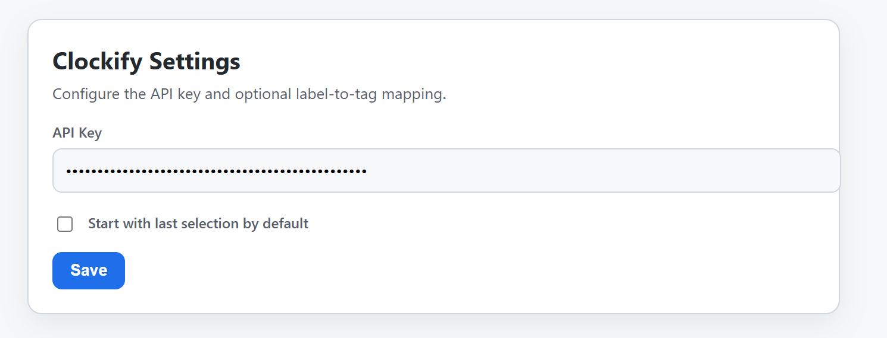
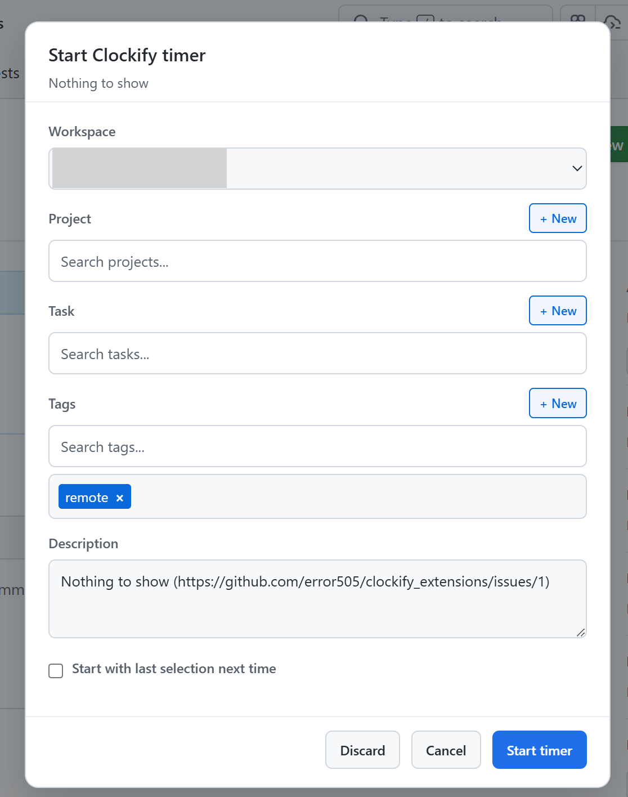

# Clockify Browser Extension

Chrome/Edge extension that adds Clockify timer controls directly to GitHub issue and PR pages.

## Installation

### Edge Browser (Recommended)
- Install directly from the **Edge Browser Marketplace**
- Open the extension Options page and paste your Clockify API key

### Chrome Browser
- Install from the **Chrome Web Store** (when published)
- Open the extension Options page and paste your Clockify API key

## Features

### Timer Management
- **Start/Stop timers** directly on GitHub issues and PRs
- **Automatic sync**: When you stop a timer in Clockify, the extension automatically stops as well
- **Real-time display**: Header badge shows elapsed time with API-verified start time
- **Quick-start**: Optional auto-start with your last selection (skip the modal)

### Smart Picker
- **Single searchable field** for projects, tasks, and tags (no more switching between fields!)
- **Create new items** on-the-fly:
  - Add new tasks
  - Create new projects
  - Add new tags
- **Auto-match labels**: Automatically apply Clockify tags based on GitHub issue labels
- **Smart memory**: Remembers last selection per repository

### Configuration
- **API Key**: Securely store your Clockify API key
- **Label-to-tag mapping**: Map GitHub labels to Clockify tag IDs
- **Quick-start toggle**: Enable/disable auto-start with last selection
- **Default workspace, project, task, and tags**: Set workspace-wide defaults

## Usage

### Starting a Timer
1. Navigate to a GitHub issue or PR
2. Click the **"Start Clockify"** button
3. In the modal, select:
   - Project (searchable)
   - Task (searchable, optional)
   - Tags (searchable, optional)
4. Press `Ctrl+Enter` (Windows/Linux) or `Cmd+Enter` (macOS) to start
5. Or press `Esc` to cancel

### Stopping a Timer
- Click the **"Stop"** button in the header
- Or stop the timer directly in Clockify—the extension will automatically sync

### Creating New Items
- While the modal is open, click **"+ New Task"**, **"+ New Project"**, or **"+ New Tag"** to create new items
- New items are immediately available for selection

## Keyboard Shortcuts
- `Ctrl+Enter` / `Cmd+Enter`: Start timer from modal
- `Esc`: Close modal and discard changes
- `Ctrl+D` / `Cmd+D`: Quick discard (clears form)

## Tips
- Use the searchable fields to quickly find projects, tasks, and tags—just start typing!
- Enable quick-start in settings to skip the modal for faster time tracking
- Map GitHub labels to tags for automatic organization of time entries
